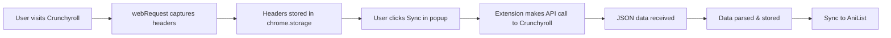

# 🎯 Guide d'Utilisation - Système API Crunchyroll

## Nouvelle Architecture

L'extension utilise maintenant **directement les APIs internes de Crunchyroll** au lieu de scraper le HTML.

### Comment ça fonctionne



## Étape par Étape

### 1. Capture des Headers d'Authentification

**Ce que vous devez faire:**
1. **Rechargez l'extension** sur `chrome://extensions/`
2. **Allez sur** n'importe quelle page Crunchyroll (par exemple votre watchlist)
3. **Ouvrez DevTools** (F12) → Allez dans l'onglet "Console"
4. **Cherchez ces messages:**
   ```
   ALTA: Capturing Crunchyroll API headers from: https://www.crunchyroll.com/content/v2/...
     → Authorization: Bearer ...
     → x-crunchyroll-policy: ...
     → x-crunchyroll-signature: ...
     → x-crunchyroll-keyPairId: ...
   ✅ ALTA: Crunchyroll headers stored: ['Authorization', 'x-crunchyroll-policy', ...]
   ALTA: Captured watchlist URL: ...
   ALTA: Stored discover GUID: 34f17284-...
   ```

✅ **Si vous voyez ces messages** : Les headers sont capturés !

### 2. Vérification des Headers Capturés

Dans la console DevTools, tapez :
```javascript
chrome.storage.local.get(['crunchyroll_headers', 'crunchyroll_discover_guid'], console.log)
```

Vous devriez voir :
```javascript
{
  crunchyroll_headers: {
    Authorization: "Bearer ...",
    "x-crunchyroll-policy": "...",
    "x-crunchyroll-signature": "...",
    "x-crunchyroll-keyPairId": "..."
  },
  crunchyroll_discover_guid: "34f17284-47d3-574c-be3d-e32ce10b4ede"
}
```

### 3. Fetch Manuel de la Watchlist

**Ouvrez le popup ALTA** et :
1. Cliquez sur l'icône 🔄 (Watchlist Sync)
2. Cliquez sur **"Synchroniser Maintenant"**
3. Le processus démarre :
   ```
   → Récupération des données Crunchyroll...
   → Synchronisation avec AniList...
   ```

### 4. Vérifier dans la Console Background

1. Allez sur `chrome://extensions/`
2. Trouvez "ALTA - Crunchyroll + Anilist"
3. Cliquez sur **"service worker"**
4. Une console DevTools s'ouvre
5. Cherchez :
   ```
   ALTA: Fetching Crunchyroll watchlist from API...
   ALTA: Using headers: ['Authorization', 'x-crunchyroll-policy', ...]
   ALTA: Using discover GUID: 34f17284-...
   ALTA: Fetching from: https://www.crunchyroll.com/content/v2/discover/.../watchlist...
   ✅ ALTA: Successfully fetched watchlist from API
     → Total items: 315
     → Data items: 315
   ```

## Que Peut-on Faire Maintenant ?

### ✅ Ce qui fonctionne

1. **Capture automatique** des headers d'authentification
2. **Stockage sécurisé** des credentials dans chrome.storage
3. **Requêtes API directes** vers Crunchyroll
4. **Parsing du JSON** avec toutes les données (images HD, descriptions, épisodes, etc.)
5. **Synchronisation** avec AniList

### 🔄 Données Disponibles

Dans le JSON Crunchyroll, vous avez accès à :

```javascript
{
  "total": 315,
  "data": [
    {
      "panel": {
        "episode_metadata": {
          "series_id": "GZJH3D8J9",
          "series_title": "Let This Grieving Soul Retire",
          "season_number": 1,
          "season_title": "Saison 1",
          "episode_number": 14,
          "sequence_number": 14,
          "audio_locale": "ja-JP",
          "duration_ms": 1430014,
          "availability_starts": "2025-10-04T15:30:00Z",
          "tenant_categories": ["Adventure", "Fantasy"]
        },
        "id": "GG1UX21JZ",
        "title": "Je veux me remémorer",
        "description": "Tino raconte à qui veut l'entendre...",
        "images": {
          "thumbnail": [
            [ { "source": "https://...", "width": 1920, "height": 1080 } ]
          ]
        }
      },
      "fully_watched": false,
      "never_watched": false,
      "playhead": 0
    }
  ]
}
```

## Prochaines Étapes Possibles

### Pour Afficher les Données dans le Popup

Vous pouvez maintenant créer une belle interface qui affiche :
- ✅ Les thumbnails HD
- ✅ Les titres des séries
- ✅ Les saisons et épisodes
- ✅ La progression (playhead)
- ✅ Les catégories (Adventure, Fantasy, etc.)
- ✅ Les descriptions

### Pour Faire d'Autres Requêtes API

Vous avez les headers stockés, vous pouvez faire n'importe quelle requête vers :
- `/content/v2/discover/.../watchlist` (watchlist)
- `/content/v2/cms/series/...` (détails séries)
- `/content/v2/cms/seasons/...` (détails saisons)
- `/content/v2/cms/episodes/...` (détails épisodes)
etc.

## Troubleshooting

### Erreur: "Crunchyroll headers not available"

**Solution:**
1. Assurez-vous d'avoir visité Crunchyroll APRÈS avoir rechargé l'extension
2. Vérifiez les logs dans la console
3. Attendez que les requests API se fassent (chargez la watchlist)

### Erreur: "Could not determine user GUID"

**Solution:**
1. Visitez spécifiquement : https://www.crunchyroll.com/watchlist
2. Attendez que la page charge complètement
3. Le GUID sera capturé automatiquement
4. Vérifiez avec : `chrome.storage.local.get('crunchyroll_discover_guid', console.log)`

### Les headers expirent

Les headers Crunchyroll (notamment le Bearer token) expirent après un certain temps.

**Solution automatique:**
- Les headers sont automatiquement re-capturés à chaque visite sur Crunchyroll
- Visitez simplement Crunchyroll à nouveau pour rafraîchir

## Commandes de Debug

```javascript
// Voir les headers capturés
chrome.storage.local.get('crunchyroll_headers', console.log)

// Voir le GUID
chrome.storage.local.get('crunchyroll_discover_guid', console.log)

// Voir toute la watchlist stockée
chrome.storage.local.get('crunchyroll_watchlist', console.log)

// Effacer les headers (pour forcer une nouvelle capture)
chrome.storage.local.remove(['crunchyroll_headers', 'crunchyroll_discover_guid'])
```

---

**Vous utilisez maintenant les vraies APIs Crunchyroll !** 🎉
